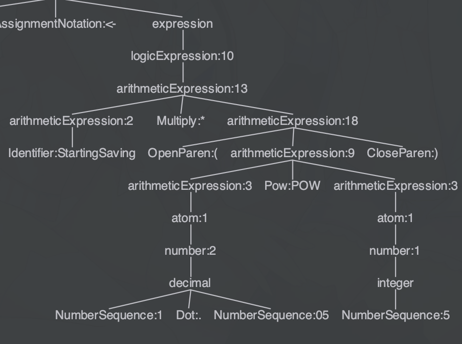

Objective: Build an LL(1) parser, tokenizer

+ What is compiler theory?

Have you wondered about how exactly did a compiler or interpreter like python can run the code you write? Entering: Compiler Theory.

But before that, we can think of something similar: reading an english passage.

How is an english passage formed? Well, we know that a passage is comprised of multiple sentences, and each sentence is comprised of multiple words.


We can write this in plain text:
```ebnf
passage: sentence+;
sentence: word+;
```

Just to be more specific, we have different kind of sentences: declarative, exclamatory, imperative, and interrogatory. Each requires a different structure. Also, we should watch out for the types of word we can choose: subject, verb, nouns, etc. For example, here is an example:

```
We know the past but cannot control it. 
```


```ebnf
passage: sentence+;
sentence: subject compound;
subject: pronoun;
compound: conjunct (conjunction conjunct)+;
conjunct: predicator object;
object: pronoun | noun | article noun;
conjunction: 'but' | 'and' | ...;
predicator: 'know' | 'control' | ...;
pronoun: 'We' | 'I' | 'You' | 'He' | ...;
noun: 'past' | ...;
article: 'a' | 'the';
```

What you have seen there is a way we describe grammar for programming languages. Now we can look at what a program's syntax tree and grammar rule looks like. It's actually quite analogous to what we've seen before.

Look at the pseudocode piece below:

```pseudocode
DECLARE StartingSaving : REAL
DECLARE ExpectedSaving : REAL

REPEAT
    OUTPUT "Input your starting saving: "
    INPUT StartingSaving
UNTIL StartingSaving > 0

ExpectedSaving <- StartingSaving * (1.05 POW 5)
OUTPUT "Expected saving in 5 years (5%):", ExpectedSaving
```


That is too much. Let's break it down.

First, we have a list of statements under our program:


```ebnf
program: statement+
```

We have declaration statements:


```ebnf
statement: declaration_statement;
declaration_statement: 'DECLARE' Identifier ':' data_type;
data_type: 'REAL' | 'INTEGER' | 'STRING' | ...
```

Expressions:

```ebnf
expr: expr '+' expr
    | expr '-' expr
    | expr '*' expr
    | expr '/' expr
    | '(' expr ')'
    | literal
    ;
literal: number | string | char | bool;
```

Assignments and repeat statement:


```ebnf
assignment_statement: Identifier '<-' expr
repeat_statement: 'REPEAT' Indent statement+ Dedent 'UNTIL' expr
statement: assignment_statement
         | declaration_statement
         | repeat_statement
         | ...
         ;
```


Now that we've seen how a grammar is like, we can try creating our toy language.


The above figure shows the different phases a compiler has. So far we've talked to the point of syntax analyzers only.


Parsers are what transforms a stream of tokens into a tree-like structure. 


We can then perform semantic checking (static checker), which is validating the correctness of the program, such as type checking. In semantic checking, errors like these can be detected:

```py
x = 3 + "s" # Error: 'int' + 'str'
print(y) # Error: y is not defined
```

Then, we enter the `intermediate code generation` phase, which is some form of the code in-between your source code and machine code. Intermediate representation (IR) is supposed to be machine-independent, and easy to optimize. This can be in any form, and does not have to be actual code (they can just remain data structures). For example the following code in C/C++:
```c
int square(int num) {
    return num * num;
}
```
Can be transformed into this [LLVM IR](https://llvm.org/docs/LangRef.html):
```llvm
define dso_local noundef i32 @square(int)(i32 noundef %num) local_unnamed_addr #0 !dbg !10 {
entry:
  call void @llvm.dbg.value(metadata i32 %num, metadata !16, metadata !DIExpression()), !dbg !17
  %mul = mul nsw i32 %num, %num, !dbg !18
  ret i32 %mul, !dbg !19
}

declare void @llvm.dbg.value(metadata, metadata, metadata) #1

attributes #0 = { mustprogress nofree norecurse nosync nounwind willreturn memory(none) uwtable "min-legal-vector-width"="0" "no-trapping-math"="true" "stack-protector-buffer-size"="8" "target-cpu"="x86-64" "target-features"="+cmov,+cx8,+fxsr,+mmx,+sse,+sse2,+x87" "tune-cpu"="generic" }
attributes #1 = { nocallback nofree nosync nounwind speculatable willreturn memory(none) }
```

Finally, machine-specific code is generated in code generation phase, or a VM can be hooked up to execute the IR directly.

## Toy language

Let's build a toy language following the phases described. Out language will have input/output feature, as well as basic math operations and assignments. The following code inputs two variables `a` and `b`, then calculates `(a + b)^2`, stores the result in variable `res`, and outputs `res`.
```
> a
> b
res = a*a + 2*a*b + b*b
< res
```
First, we will try to formulate the grammar our language uses:
```antlr4
program: statement+;
statement: assignment_statement
         | input_statement
         | output_statement
         ;
assignment_statement: ID '=' expression;
input_statement: '>' ID;
output_statement: '<' ID;

expression: expression ('+' | '-') term
          | term;
term: term ('*' | '/') atom
    | atom;
atom: ID | INTEGER | '(' expression ')';
ID: [a-z]+;
INTEGER: [0-9]+;
WS: [ \t\n]+ -> skip;
```

We need to first introduce the concept of tokens: a token is a group of characters with its identified type. For example, `+` is recognized as an addition token, and `abc` an identifier token. 

So we first have a number of tokens to consider: `ID`, `INTEGER`, `+`, `-`, `*`, `/`, `(`, `)`, `=`. This is rather easy to do: we first define the token types to be an Enum, then make something that takes in the source code and spits out a list of tokens. There's a special case: whitespaces (new lines, spaces, tabs, and end of file), which is skipped but indicates the end of a token.

You can see my implementation of `Token` and `TokenType` below:

tokens.py
```py

from dataclasses import dataclass
from enum import IntEnum


class TokenType(IntEnum):
    Eof = -1
    Unknown = 0
    Integer = 1
    Identifier = 2
    Add = 3
    Subtract = 4
    Multiply = 5
    Divide = 6
    OpenParenthesis = 7
    CloseParenthesis = 8
    Assign = 9
    Input = 10
    Output = 11

@dataclass
class Token:
    token_type: TokenType
    content: str = ""
```

Turning a sequence of characters into a sequence of tokens is helpful, and usually applied in real world scenarios, because we can focus on the type of the token, not the exact content inside that is irrelevant when we form a tree for our code.


Lexer:
```py
from tokens import Token, TokenType
class Lexer:
    def __init__(self, content: str) -> None:
        self.content = content
        self.current_peek_index = 0
    
    def peek(self) -> str:
        if self.current_peek_index >= len(self.content):
            return None
        return self.content[self.current_peek_index]
    def consume(self) -> str:
        consumed_char = self.peek()
        self.current_peek_index += 1
        return consumed_char
    
    def tokens(self):
        while True:
            peek_char = self.peek()
            if peek_char == None:
                yield Token(TokenType.Eof, "$")
                break
            if '0' <= peek_char <= '9':
                content = self.consume()
                while self.peek() != None and '0' <= self.peek() <= '9':
                    content += self.consume()
                yield Token(TokenType.Integer, content)
            elif peek_char.isalpha():
                content = self.consume()
                while self.peek() != None and self.peek().isalnum():
                    content += self.consume()
                yield Token(TokenType.Identifier, content)
            elif peek_char == '+':
                yield Token(TokenType.Add, self.consume())
            # ... Similar process for -*/()=
            elif peek_char.isspace():
                self.consume()
                continue
            else:
                yield Token(TokenType.Unknown, self.consume())
```

What this does is basically consume a sequence of characters and yield a number of tokens. For this sample code:
```
>a >b >c
d = 2*a*(b + c*a)
<d
```
We feed the source into the lexer, and the lexer can give us a list of tokens: a kind of object that identifies a group of characters with its type, like identifiers
```
[Input '>'] [ID 'a'] [Input '>'] [ID 'b'] [Input '>'] [ID 'c'] [ID 'd'] [Assign '='] [INT '2'] [Multiply '*'] ...
```
Notice that 'a', 'b', 'c' and 'd' are all recognized as an ID for the ease of processing which we will talk about now.

OK. We now have a list. But for even easier processing, we also need a tree structure built from it. Something like this:


Can we develop an algorithm for that? Yes. First we should define the data structures for the tree. [^AST]
[^AST]: [This file](AST.py)

Then, we add helper functions `peek`, `consume` and `match`. `peek` looks at the next token, but does not eat it; `consume` looks and eats the next token; `match(t)` checks if the next token has type `t`. It eats the token if they match, or raises and error if not.

One way of approaching this is that we treat every rule (like `program: statement+;`) as a function. We start from an atom: it accepts an identifier, an integer, or an expression surrounded by a pair of parenthesis. We need to be able to distinguish between them, and return the node:
```py
def atom(self):
    """
    atom: ID | INTEGER | '(' expression ')';
    """
    peek = self.peek()
    base = None
    if peek.token_type == TokenType.OpenParenthesis:
        self.match(TokenType.OpenParenthesis)
        base = self.expression()
        self.match(TokenType.CloseParenthesis)
    elif peek.token_type == TokenType.Identifier:
        base = AST.Identifier(self.match(TokenType.Identifier))
    elif peek.token_type == TokenType.Integer:
        base = AST.Integer(self.match(TokenType.Integer))
    return base
```
Similarly, for `term()`:
```py
def term(self):
    """
    term: term ('*' | '/') atom
        | atom;
    """
```
...???
We have left recursion here. If we try to call the `term()` inside `term()` unconditionally at the start, we would end up in a forever loop. This is called left recursion.

We can resolve left recursion by translating the grammar for `term` into
```ebnf
term: atom (('*' | '/') atom)*;
```
and sort the data structure out ourselves.
```py
def term(self):
    """
    term: atom (('*' | '/') atom)*;
    """
    base = self.atom()
    while True:
        peek = self.peek()
        match peek.token_type:
            case TokenType.Multiply | TokenType.Divide:
                self.consume()
                right = self.atom()
                base = AST.BinaryOperation(base, peek.token_type, right)
            case _:
                return base
```
Similar stuff applies to other rules. Here is the entry rule `program()`:
```py
def program(self):
    statements = []
    while True:
        peek_token = self.peek()
        match peek_token.token_type:
            case TokenType.Identifier:
                statements.append(self.assignment_statement())
            case TokenType.Output:
                statements.append(self.output_statement())
            case TokenType.Input:
                statements.append(self.input_statement())
            case TokenType.Eof:
                return AST.Program(statements)
```

### Semantic Analysis

We did a little bit simplification here, and didn't even include a type system. So this phase is not included in our example.

### Emit

We 'emit' an intermediate representation of the code. This is between the high-level code we write and the low-level machine code we generate.

A `three address code` is an instruction like this:
`op x y z`. `x`, `y`, and `z` are addresses, and `op` is an operation. This means "Calculate `x op y`, and store the result into `z`". The advantage of generating an intermediate representation is that we can more easily write different compiler `backend`s for the same intermediate representation, and optimize the code.

In our example, the code mentioned above will yield this result:
```
Input    0  0  1 
Input    0  0  2 
Input    0  0  3 
StoreImmediate 2  0  4 
Multiply 4  1  5 
Multiply 3  1  6 
Add      2  6  7 
Multiply 5  7  8 
Store    8  0  9 
Output   9  0  0
```

### Codegen

This is classified as a backend stage. We generate actual machine code that the computer can directly execute. 

I wrote a backend that generates `CAIE Assembly Code` that you learned about in theory paper:

```asm
001 2
512 IN
513 STO 1
514 IN
515 STO 2
516 IN
517 STO 3
518 LDD 1
519 STO 4
520 LDD 4
521 MUL 1
522 STO 5
523 LDD 3
524 MUL 1
525 STO 6
526 LDD 2
527 ADD 6
528 STO 7
529 LDD 5
530 MUL 7
531 STO 8
532 LDD 8
533 STO 9
534 LDD 9
535 OUT
```

### VM

We can also choose to not generate any machine code. Rather, we directly interpret the immediate representation we generated. This we call a virtual machine (VM). We see VMs being used in Java, where bytecodes are interpreted by an executable `java`.

There we go!


