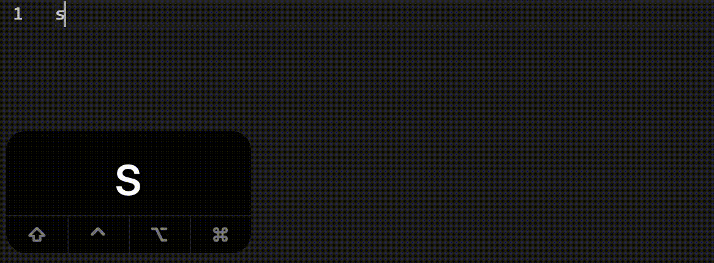

# Coding Style

Consider this following code:

```py
def is_Anagram(a,b):
    v=[False]*len(a)
    for I in range(len(a)):
      f=False
      for J in range(len(b)):
         if not v[J]:
             if b[J]==a[I]:
                 v[J]= True
                 f =True
                 break
      if not f:return False
    return True
```

Does that look weird to you? When we write programs, we should not only take care of the algorithms or structures themselves, but also formatting and documents. These keep the code readable, both to you and others.

I don't even know what this program is supposed to do when I see the mess I wrote:
```cpp
int main() {
    MAIN_FILE_HEADER
    // "RPS"
    int n;
    cin >> n;
    f0r(i, n) {
        char och, sch;
        cin >> och >> sch;
        int opp = och - 'A';
        int need = sch - 'X';
        int self = opp;
        if (need == 0) {
            self = (opp + 2) % 3;
        } else if (need == 1) {
            score += 3;
        } else {
            self = (opp + 1) % 3;
            score += 6;
        }
        score += self + 1;
    }
    cout << score << endl;
    return 0;
}
```

WTH is `RPS` supposed to mean? `och`, `sch`????? 

It's worth noting that coding styles are probably not important in certain cases, for example in a coding competition or [Code Gulf](code.golf). In fact, the code above was written for a competition. Because we don't actually care about maintainability or readability in such cases, we can safely omit the coding styles - why bother when no one (including you) is gonna see the code later?

However, in most of the cases, coding style is important. We want the code to be readable, understandable and maintainable. For this to be achieved, certain aspects of the code must be standardized, so we know, for example, if the symbol we're looking at a class or a variable, and we won't have several coding styles in the same file, which is painful to look at.

### Naming

One big aspect of coding styles is naming. There's a programmer's joke on the Internet saying the most difficult thing for programmers is naming things. Indeed, this statement is only a little exaggerated. It's actually quite hard to think of a name that can mostly describe the purpose it's for sometimes. Here are some general tips about this:

It's generally **not** a good idea to just name stuff like `anapple`, `btndenglu`, and `p`. Without context, we can not really see the intent of the variable and how it's supposed to be. We can have different ways to fix this.

#### Distinguish between words

We have different conventions for naming, including but not limited to:

| Naming Convention | Example               | Description |
|-------------------|:---------------------:|-------------|
| PascalCase       | `UpdatePodAI`<br/>`SyncToStorage`         | The first character of every word is capitalized, including prepositions |
| camelCase | `accuracySum`<br/>`thisRoundCompletionCount` | Pascal case, but the first word isn't capitalized |
| snake_case | `validate_age`<br/>`play_audio` | All little case, and words are joined with an underscore `_` |
| kebab-case | `online-data-source`<br/>`reflect-metadata` | All little case, and words are joined with a hyphen `-` |
| CONSTANT_CASE / SCREAMING_SNAKE_CASE | `APP_PATH`<br/>`PORT_NUMBER` | All caps, and the words are joined with an underscore `_` |

The use of different casings varies from language to language, company to company, and even organization to organization. For example, in `Python` it's generally recommended to use `snake_case` for functions and local variables. On the other hand, in `C#` we have `PascalCase` for classes and methods, and `camelCase` for local variables.

Python code sample:
```py
DEFAULT_NAME = "John Smith" # Screaming snake case for constants
# All snake_case
def test_get_str_value():
    # JsonParseNode is a class, named in PascalCase
    parse_node = JsonParseNode("Diego Siciliani")
    result = parse_node.get_str_value()
```

C# code sample:
```cs
// PascalCase for all classes/interfaces
public class SourceLocation
{
    // PascalCase for all public members and methods
    public static readonly SourceLocation Identity = new(-1, -1);
    public readonly int Column;
    public readonly int Line;
    public const int IdentityLine = 1;
    // '_'-prefixed camelCase for private members
    private int _referenceCount;

    public SourceLocation(int line, int column)
    {
        Line = line;
        Column = column;
    }
    public override string ToString()
    {
        return $"({Line}:{Column})";
    }
}
```

In fact, there can be different naming convention for one language. In Google's c++ style guide about [function names](https://google.github.io/styleguide/cppguide.html#Function_Names) and [constant names](https://google.github.io/styleguide/cppguide.html#Constant_Names), `PascalCase` is preferred for the former and `k`-prefixed `camelCase` the latter:

```cpp
const int kDaysInAWeek = 7;
const int kAndroid8_0_0 = 24;  // Android 8.0.0
void ComputeFoo(absl::string_view suffix) {
  // Either of these is acceptable.
  const absl::string_view kPrefix = "prefix";
  const absl::string_view prefix = "prefix";
  ...
}
```

[C++ Core Guidelines](http://isocpp.github.io/CppCoreGuidelines/CppCoreGuidelines#nl10-prefer-underscore_style-names), by the C++ creator [Bjarne Stroustrup](https://www.stroustrup.com/) himself, states that everything should be in `snake_case` (but if other conventions are used in third party libraries, you are free to choose):
```cpp
// Everything is snake_case
int some_var = 2;
vector<int> v;
// ...
v.push_back(some_var);
```


#### Don't overuse abbreviations

Yes, acronyms save time and space to write. Sometimes we just want to trim names like `ApplicationDatabaseManagerPlugin` to something like `admp`, but what if someone else comes and checks your code? Or simply, what if you come back from a long break and forgot what you did?

Nowadays we have `IDE`s and `auto-complete`, and this is a game changer:



What a mind-blowing feature to discover. Just typing the variable name like typing an acronym, and the IDE can complete the name for you. Using this feature, you get to have a better readability for your code and faster typing speed at the same time.

However, if it is some commonly used abbreviations like `HTTP`, `int`, and `res`, it is plausible and even recommended. No one's gonna blame you for using `i` in a for-loop, so long as you make it clear that you are referring to an index. Nor will they think you are cool for naming something `HyperTextMarkupLanguageDocumentObjectModelBuilder` - they are just too long, what about `HtmlDomBuilder`?

#### Don't use words from other languages for your variable name

You may have noticed that I have put an example of this `btndenglu`. DON'T DO THIS EVER

### Spacing

We put spaces after commas, periods, and before parenthesis when writing in English,or it would look like this.Quite compact and uncomfortable. Spacing in coding is analogous. Which one looks nicer here:
```py
sum_of_squares=n*(n+1)*(2*n+1)/6 # this?
sum_of_squares = n * (n + 1) * (2 * n + 1) / 6 # or this?
sum_of_squares = n*(n + 1)*(2*n + 1)/6 # or this?
```

Clearly, the second or the third one, right? In general, for binary `operation`s in the form `A op B`, such as `a=b`, `a+b`, it's better to put spaces both before and after the operand (`=` and `+`).

What about this:
```py
def this(a=3,b:str="quack"):
    pass
this(a=4)

def or_this(a=3, b: str = "quack"):
    pass
or_this(a=4)
```
It should seem obvious. Commonly, when encountering punctuations like `,`, `:`, a space should be added after but not before. One exception is `C++`'s ranged for expression:
```cpp
for (auto x : counts) {
    //...
}
```

There's also these line breaking problems. 

1. Taken from [PEP8](https://peps.python.org/pep-0008/#should-a-line-break-before-or-after-a-binary-operator)
```py
# Wrong:
# operators sit far away from their operands
income = (gross_wages +
          taxable_interest +
          (dividends - qualified_dividends) -
          ira_deduction -
          student_loan_interest)
```

We don't want to look across two lines, so it's better that we write the code this way:

```py
# Correct:
# easy to match operators with operands
income = (gross_wages
          + taxable_interest
          + (dividends - qualified_dividends)
          - ira_deduction
          - student_loan_interest)
```

You may also see similar styles in chained function calls (not in python, though):

```rust
// Selects all odd numbers from [0..100)
// and then sum their squares
let odd_square_sum: i32 = (0..100)
    .filter(|num| num % 2 == 1)
    .map(|num| num * num)
    .sum();
```

2. Braces `{}` are also something to take care of, if the language you use treats this as a code block or a dictionary. For example, this `C`-ish code:
```cpp
if (x == 9) {
    break;
}
```

In different style guides, the open brace `{` is positioned differently. The example shown above is preferred by [Google](https://google.github.io/styleguide/cppguide.html#Function_Declarations_and_Definitions):

> The open curly brace is always on the end of the last line of the function declaration, not the start of the next line.

Microsoft, states otherwise, and suggests making a new line for open braces `{`:
```cpp
if (x == 9)
{
    break;
}
```

#### Indentation

Make sure we have a fixed amount of whitespaces for indentation.
Notice on the first code snippet in this file, there are inconsistent indentation (First 4, then 2, then 3, then 4). We should change them to a fixed amount, and configure that in our IDEs too. We can also make the IDE determine on its own what the indentation level is when we see a file.


It's also more preferred to use whitespaces instead of tabs. For example, someone wrote some code with tab width set to 4:
```py
item        = 1 # Just assume they are tabs
item_count  = 3
```
Someone with tab width set to 2 may see:
```py
item    = 1
item_count  = 3
```
They become misaligned.


### Shared Coding Standard

If there's a coding standard present, adhere to it and don't stick to what you like. Similarly, if you are managing a team of developers, make sure you have a common coding style standard. This makes sure that everyone's code is coherent and pretty.


### Documentation

Documentation helps others to read code better. In `Python` [^docstring], documentations are declared inline like this:

```py
def sum_of_square(n):
    """Sums the square of all x from 1 to n inclusive and returns the result
    :param n: The upper bound of the summation
    :type n: int
    :raises ArithmeticError: n is less than 0
    :returns: The square sum from 1 to n inclusive
    :rtype: int
    """
    if n < 0:
        raise ArithmeticError("n should be greater than or equal to 0")
    return n * (n + 1) * (2 * n + 1) / 6
```

You should annotate every function you write, because you might not remember its purpose a few weeks after you wrote it.

If your function is incomplete and needs development in the future, mark it with `TODO`:

```py
def add_entry(entry):
    # TODO search for existing entry, add if not present
    pass
```

Later, you can search over all code with `TODO`s and complete all incomplete code.

### Nesting [^nesting]

This kind of code is painful to look at:
```py
if ...
    if ...
        while ...
            for ...
                if ...
                    ...
                else:
                    ...
    elif ...
else
    ...
```

Utilize wisely the keywords `break`, `continue` and `return`, and optimize logic flow to reduce nesting.

```py
# Drop else statement at the end
def ...
    if ...
        return ...
    else
        return ...
# Change to this
def ...
    if ...
        return ...
    return ...
```

```py
def ...
    if conditionA:
        if conditionB:
            # Blob of code
            stmtA
            stmtB
            stmtC
        else:
            return False
    else:
        return False
# To
def ...
    if not conditionA:
        return False
    if not conditionB:
        return False
    # You could do this also, but consider
    # Line size
    if not conditionA or not conditionB:
        return False
    stmtA
    stmtB
    stmtC
    ...
```

```py
for i in range(n):
    if conditionA:
        stmts
    else:
        break
# To
for i in range(n):
    if not conditionA:
        break
    stmts
```

Returning (or breaking) early can inform you better on when a loop or a control flow ends, while reducing the number of nesting.

### Premature Optimization

[This article](https://softwareengineering.stackexchange.com/a/80094)

```py
def is_anagram(a, b):
    visited = [False] * len(a)
    for i in range(len(a)):
        found = False
        for j in range(len(b)):
            if visited[j]:
                continue
            if b[j] == a[i]:
                visited[j] = True
                found = True
                break
        if not found:
            return False
    return True
```

[^nesting]: https://en.wikibooks.org/wiki/Computer_Programming/Coding_Style/Minimize_nesting
[^docstring]: https://peps.python.org/pep-0257/